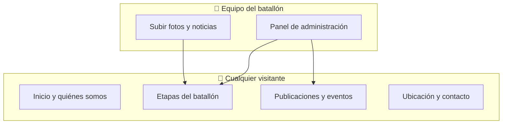
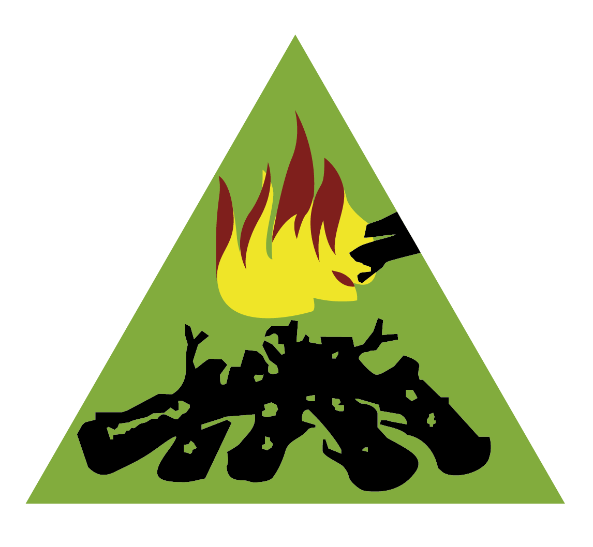
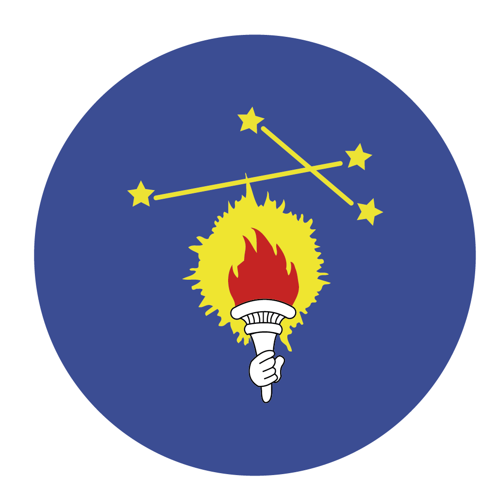
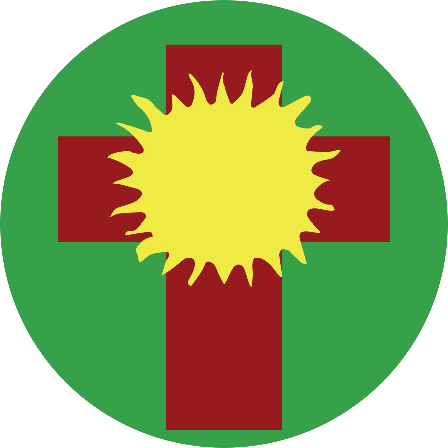

<p align="center">
  
</p>

<h1 align="center">Batallón 11 — General José María Paz</h1>

<p align="center">
  Sitio web del grupo de los <strong>Exploradores Argentinos de Don Bosco</strong> (Salesianos)
</p>

<p align="center">
  
  
  
</p>

<p align="center">
  
</p>

---

## 🏕️ ¿Qué es este proyecto?

Es la **página oficial del batallón**: un lugar en internet donde la comunidad exploradoril puede **conocer la propuesta**, **ver novedades**, **enterarse de eventos** y **acercarse a cada etapa** del camino formativo.



### 👥 ¿Para quién está pensado?

| | Quién lo usa | Para qué sirve |
| --- | --- | --- |
| 👨‍👩‍👧 | **Familias y visitantes** | Ver información del batallón, ubicación, contacto, fotos y noticias sin registrarse. |
| 🧭 | **Exploradores y jóvenes** | Entrar a la página de su etapa y ver publicaciones y galerías de su grupo. |
| 📋 | **Coordinadores y animadores** | Mantener el sitio al día desde el panel de administración. |

> 💡 **En pocas palabras:** reemplaza o complementa la cartelera física del grupo con un espacio digital ordenado, accesible desde el **celular** o la **computadora**.

---

## 🌐 ¿Qué se puede hacer en el sitio?

### 👀 Parte pública (cualquier persona)

| Sección | Qué encontrás |
| --- | --- |
| 🏠 **Inicio** | Presentación del batallón, quiénes somos y acceso a las etapas. |
| 🎖️ **Etapas** | Página propia de cada grupo con emblema, descripción, publicaciones y fotos. |
| 📰 **Publicaciones** | Novedades generales: actividades, avisos y momentos compartidos. |
| 📅 **Eventos** | Próximas actividades con fecha y lugar. |
| 📍 **Ubicación y contacto** | Cómo llegar y cómo comunicarse con el grupo. |

### 🔐 Panel de administración (solo usuarios autorizados)

- ✏️ Publicar y editar **noticias** del sitio general o de una etapa concreta.
- 🖼️ Subir y ordenar **fotos** en las galerías.
- 📆 Gestionar **eventos** del calendario.
- 🔑 Acceso con usuario y contraseña; algunos roles solo editan su propia etapa.

☁️ Las imágenes pueden guardarse en el servidor o en **Supabase Storage** (nube), según la configuración.

---

## 🎖️ Etapas del batallón

Cada etapa tiene su propia página. Desde el celular se ven publicaciones compactas y galería en carrusel; en computadora, el diseño es más amplio.

| | Etapa | Página |
| ---: | --- | --- |
|  | **Horneros y Pichones** | `/etapas/horneros-pichones` |
|  | **Caminantes y Chispistas** | `/etapas/caminantes-chispistas` |
|  | **Pioneros y Fuegos** | `/etapas/pioneros-fuegos` |
|  | **Rastreadores** | `/etapas/rastreadores` |
|  | **Baqueanos** | `/etapas/baqueanos` |
|  | **Soles** | `/etapas/soles` |

📌 En cada etapa se muestran hasta **4 publicaciones** y una **galería**; si hay más contenido, aparece un botón **“Ver más”**.

---

## ⚙️ ¿Cómo está hecho por dentro?

El proyecto tiene dos partes que trabajan juntas:

| Parte | Carpeta | Rol |
| --- | --- | --- |
| 🖥️ **Sitio visible** | `client/` | Lo que ve la gente: diseño, menús y páginas. |
| ⚡ **Motor de datos** | `server/` | Guarda y entrega publicaciones, fotos, usuarios y eventos. |

Los datos viven en **PostgreSQL** (por ejemplo Supabase). El repositorio usa **pnpm** para instalar todo de una sola vez.

---

## 🚀 Puesta en marcha

> 🛠️ Esta sección es para quien **desarrolla o mantiene** el sitio.

### ✅ Requisitos

| Herramienta | Versión |
| --- | --- |
| 🟢 **Node.js** | 22 o superior |
| 📦 **pnpm** | 9 o superior |
| 🗄️ **PostgreSQL** | Supabase recomendado |

### 📋 Pasos básicos

```bash
# 1. Instalar dependencias
pnpm install

# 2. Configurar variables de entorno
#    Crear server/.env y client/.env
#    (base de datos, JWT, admin, mapas, etc.)

# 3. Preparar la base de datos
pnpm prisma:migrate
pnpm prisma:generate
pnpm prisma:seed

# 4. Arrancar en modo desarrollo
pnpm dev
```

| Dónde | URL |
| --- | --- |
| 🌐 Sitio web | http://localhost:5173 |
| 🔌 API | http://localhost:4000 |

📱 **Probar desde el celular (misma Wi‑Fi):** abrí `http://<IP-de-tu-PC>:5173` — la IP la muestra Vite al iniciar.

### 🗄️ Base de datos con Supabase

1. Supabase → **Project Settings → Database**
2. **Transaction pooler** (puerto `6543`) → `DATABASE_URL`
3. **Direct** (puerto `5432`) → `DIRECT_URL`
4. Agregá `?pgbouncer=true&sslmode=require` en el pooler si falta

---

## 📜 Scripts útiles

| Comando | Qué hace |
| --- | --- |
| `pnpm dev` | 🚀 Frontend + backend juntos |
| `pnpm dev:client` | 🖥️ Solo el sitio web |
| `pnpm dev:server` | ⚡ Solo la API |
| `pnpm build` | 📦 Versión de producción del frontend |
| `pnpm start` | ▶️ Servidor en producción |
| `pnpm prisma:studio` | 🔍 Visor visual de la base de datos |

---

## ☁️ Despliegue

| Componente | Opciones habituales |
| --- | --- |
| 🖥️ Frontend | Vercel, Netlify |
| ⚡ Backend | Railway, Render |
| 🗄️ Base de datos | Supabase, Neon, Railway |

Variables clave en producción: `DATABASE_URL`, `JWT_SECRET`, `CLIENT_URL` (servidor) y `VITE_API_URL` (cliente).

---

## 📄 Licencia

MIT — ver [LICENSE](./LICENSE).

<p align="center">
  <sub>⛺ Batallón 11 Gral. José María Paz · Exploradores Argentinos de Don Bosco</sub>
</p>
